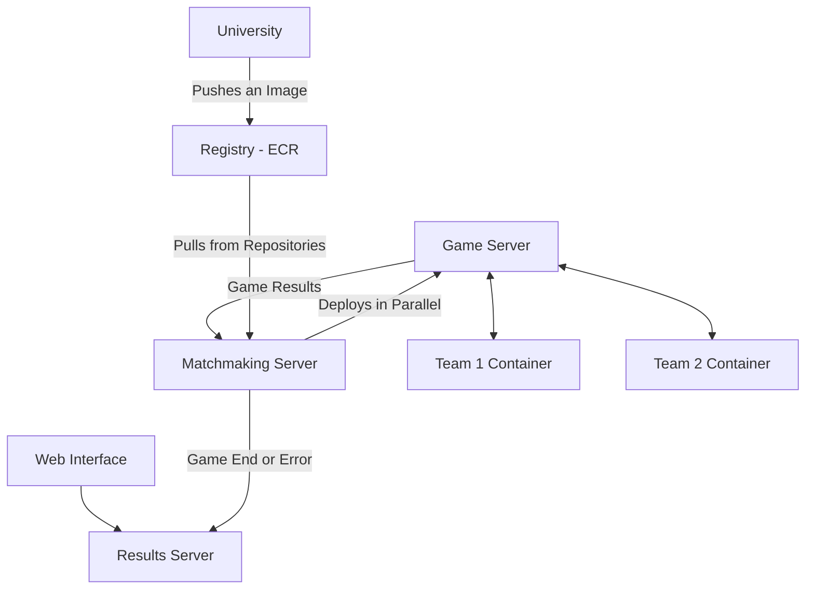

# Programmation - CQI 2025

This document contains technical information about the competition. It is divided into three sections.

- [Programmation - CQI 2025](#programmation---cqi-2025)
  - [1. Server Interaction Details](#1-server-interaction-details)
    - [Game Start](#game-start)
    - [Gameplay](#gameplay)
    - [Game End](#game-end)
  - [2. Deployment Instructions](#2-deployment-instructions)
    - [Infrastructure Overview](#infrastructure-overview)
    - [Deployment](#deployment)
  - [3. How to Test Your Solution Locally](#3-how-to-test-your-solution-locally)

## 1. Server Interaction Details

This subsection details the interactions between your bot and the game server. The game server provided locally is the same as the one deployed on the evaluation infrastructure.

### Game Start

To start the game, the server sends a `POST` request to the `/start` endpoint of each bot (offense and defense). This request validates that each bot is ready to play.

**Request Body**:

The server informs the bot whether it is playing offense or defense, as well as the colors of the various elements on the map. If it is on offense, the bot receives the maximum number of moves it can make. If it is on defense, the server provides the number of walls it can place during the game.

**Response**: The bot must respond with a 200 status code.

**Example Request for Offense**:

```json
{
    "is_offense": true,
    "max_moves": 200,
    "element_types_color": {
        "background": "#FFFFFF",
        "wall": "#000000",
        "offense_player": "#FF0000",
        "goal": "#FFD700",
        "large_vision": "#4CBB17",
        "timebomb": "#0099CC",
        "timebomb_second_round": "#006699",
        "timebomb_third_round": "#003366"
    }
}
```

**Example Request for Defense**:

```json
{
    "is_offense": false,
    "n_walls": 30,
    "element_types_color": {
        "background": "#FFFFFF",
        "wall": "#000000",
        "offense_player": "#FF0000",
        "goal": "#FFD700",
        "large_vision": "#4CBB17",
        "timebomb": "#0099CC",
        "timebomb_second_round": "#006699",
        "timebomb_third_round": "#003366"
    }
}
```

### Gameplay

To play, the server alternately sends a `POST` request to the `/next_move` endpoint of each bot. This request can be sent at any time during an ongoing game.

**Request Body**: The bot receives an image of the map. The image, encoded in Base64, is in PNG format. Note that the map received by the attacker is partial, while the defender can view the entire game area.  
The map's dimensions may vary. However, each cell always measures 20px x 20px, and each cell is filled with a single color.

> [!NOTE]
> Unlike the visualization in the web interface, the maps sent to bots do not have borders. The PNG maps consist solely of 20px x 20px colored squares.

**Example Request**:

```json
{
    "map": "wq9cXyjjg4QpXy/Crwo="
}
```

**Response**: The bot on offense must respond with a valid move, which can be `up`, `down`, `left`, `right`, or `skip`. The bot on defense must indicate the position of the obstacle it wants to place and the type of obstacle (valid options: `wall`, `timebomb`, `skip`).

**Example Offense Response**:

```jsonc
{
    "move": "left" // Or up, down, right, skip
}
```

**Example Defense Response**:

```jsonc
{
    "x": 0,
    "y": 0,
    "element": "wall" // Or timebomb, skip
}
```

> [!NOTE]
> Reminder: The coordinate (0, 0) is always positioned at the top-left corner of the received image.

### Game End

At the end of a game, a `POST` call is made to the `/end_game` endpoint. The container for your bot must then shut down.

**Request Body**: Empty

**Example Response**: A response with no body must be returned with a 200 status code.

## 2. Deployment Instructions

This section outlines the deployment process and the evaluation architecture's functioning.

### Infrastructure Overview

To enable teams' agents to compete against each other, multiple AWS ECR repositories (one per team) have been created. The credentials provided at the start of the competition grant access to these repositories. Once images are available in these repositories, matches are launched on a dedicated set of machines. All machines have the same specifications.

During matches, two games occur simultaneously. The matches are executed in isolated environments, agents cannot communicate with each other or the outside world, and they can only interact with the game server. In each match, teams' roles are reversed: the team playing offense in one match will play defense in the other. Once both games are completed, the results are stored and can be viewed via the [game interface](https://cqiprog.info).

The following diagram summarizes the infrastructure (**optional and not required for the competition**):



> [!IMPORTANT]  
> The machines running the matches use the `x86_64` architecture. Images pushed to the repository must be compiled to be compatible with this architecture; otherwise, matches cannot start, and an error will be returned. If your computer has an ARM processor (e.g., Mac M1 or later), you must use the `push-amd64.sh` script to push your images to the ECR.

The game interface allows listing the latest matches and accessing their execution details (by clicking on them). It also provides access to the last 200 logs (200-character lines) produced by the agents' containers, as well as the game map to track match progress (note: there are two matches per game). The game server logs are also available and linked to the turn displayed on the map.

The interface also provides access to the provisional team rankings. These rankings are based on matches that took place in the last few minutes. The period considered in the rankings is displayed at the top of the table. Scores in this table are for informational purposes only. Agent evaluation will take place after the competition ends.

> [!NOTE]
> After the competition, access to the game interface will be automatically disabled.

### Deployment

To deploy your solution, you need to:

1. Containerize your agent. Reminder: you must first install [Docker](https://docs.docker.com/get-started/get-docker/).
2. Log in to AWS using your credentials via [aws-cli](https://docs.aws.amazon.com/cli/latest/userguide/getting-started-install.html).
3. Connect to your ECR (AWS repository) through Docker.

The first step is up to you. You can draw inspiration from the work done during the pre-CQI if needed.

The `docker-login.sh` script automates steps 2 and 3. This script handles Docker login to your ECR (`docker login`); you only need to input the two AWS keys associated with your team provided at the start of the competition:

- `AWS_ACCESS_KEY_ID`
- `AWS_SECRET_ACCESS_KEY`

Once connected, you can push your images using `docker push`. The image name must follow the format `481665101132.dkr.ecr.us-east-1.amazonaws.com/<team_id>:latest`.

> [!TIP]
> Although the `push-amd64.sh` script is designed to compile an `x86_64` image on an ARM machine, you can still use or adapt it.

For example, if your team ID (provided with your AWS keys) is `universiteduquebecafermont`, your image can be pushed with the following command:

```bash
docker push 481665101132.dkr.ecr.us-east-1.amazonaws.com/universiteduquebecafermont:latest
```

> [!IMPORTANT]
> The `latest` tag is mandatory. If a different tag is used, your image will never be launched.

The deployed image must listen for incoming requests on `0.0.0.0:5000`. It will be automatically launched and evaluated against the bots of other teams. The latest pushed image will always be the one used. Deployed images must not exceed 200 MB in size.

## 3. How to Test Your Solution Locally

To test your solution locally, you can download the game server image and a very basic bot (`Easy Bot`).

The `compose.yml` file already contains the necessary configurations to launch the basic bot and the game server. To test your agent, you need to specify the location of your `Dockerfile` in the `your_bot` section. If you do not yet have a `Dockerfile`, you can comment out the `your_bot` section and provide the game server with the address of your program.

For example:

```yml
environment:
    - OFFENSE_URL=http://bot:5000
    - DEFENSE_URL=http://host.docker.internal:5000 # Instead of http://your_bot:5000
```

You can also swap the roles of the agents to test offense and defense. You could even deploy your bot twice to have it play against itself!

The `SEED` and `MAX_MOVE` parameters control, respectively, the reproducibility of matches and the maximum number of moves for the attacker. Setting the `SEED` parameter ensures the same configuration (e.g., map size). This parameter takes a random value.

Once a match has been simulated locally, you can access match data (e.g., score, map, logs) by performing a `GET` request on `localhost:5002/status`.

**Have a good CQI!!**
