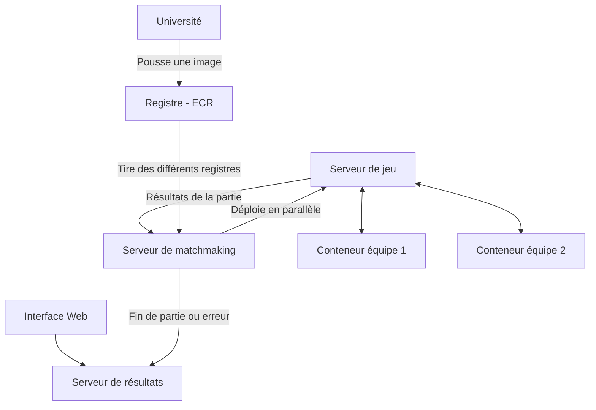

# Programmation - CQI 2025

Ce document contient des informations techniques concernant la compétition. Il est séparé en trois sections.

- [Programmation - CQI 2025](#programmation---cqi-2025)
  - [1. Détails des interactions avec le serveur](#1-détails-des-interactions-avec-le-serveur)
    - [Lancement de la partie](#lancement-de-la-partie)
    - [Déroulement d’une partie](#déroulement-dune-partie)
    - [Fin de la partie](#fin-de-la-partie)
  - [2. Instructions de déploiement](#2-instructions-de-déploiement)
    - [Fonctionnement de l'infrastructure](#fonctionnement-de-linfrastructure)
    - [Déploiement](#déploiement)
  - [3. Comment tester localement votre solution](#3-comment-tester-localement-votre-solution)

## 1. Détails des interactions avec le serveur

Cette sous-section détaille les interactions entre votre agent intelligent et le serveur de jeu. Le serveur de jeu mis à votre disposition localement est le même que celui déployé sur l'infrastructure d'évaluation.

### Lancement de la partie

Afin de lancer la partie, le serveur envoie une requête ``POST`` sur ``/start`` à chaque agent intelligent (attaque et défense). Cette requête permet de valider que chacun des agents intelligents est prêt à jouer.

**Corps de la requête** :

Le serveur indique à l’agent intelligent s’il est en attaque ou en défense ainsi que la couleur des différents éléments présents sur la carte. S'il est en attaque, l'agent intelligent reçoit le nombre maximum de déplacements qu'il pourra effectuer. S'il est en défense, le serveur lui indique plutôt le nombre de murs qu’il peut placer au courant de la partie.

**Réponse** : L’agent intelligent doit répondre avec le code 200.

**Exemple de requête en attaque** :

```json
{
    "is_offense": true,
    "max_moves": 200,
    "element_types_color": {
        "background": "#FFFFFF",
        "wall": "#000000",
        "offense_player": "#FF0000",
        "goal": "#FFD700",
        "large_vision": "#4CBB17",
        "timebomb": "#0099CC",
        "timebomb_second_round": "#006699",
        "timebomb_third_round": "#003366"
    }
}
```

**Exemple de requête en défense** :

```json
{
    "is_offense": false,
    "n_walls": 30,
    "element_types_color": {
        "background": "#FFFFFF",
        "wall": "#000000",
        "offense_player": "#FF0000",
        "goal": "#FFD700",
        "large_vision": "#4CBB17",
        "timebomb": "#0099CC",
        "timebomb_second_round": "#006699",
        "timebomb_third_round": "#003366"
    }
}
```

### Déroulement d’une partie

Afin de jouer, le serveur envoie une requête ``POST`` sur ``/next_move`` à tour de rôle à chaque agent intelligent. Cette requête peut être lancée à tout moment lorsqu’une partie est en cours.

**Corps de la requête** : L’agent intelligent reçoit une image de la carte. L’image encodée en base64 est au format PNG. Il est à noter que la carte reçue par l'attaquant est partielle, alors que le défenseur peut voir toute la partie.
La dimension de la carte peut varier. Cependant, chaque case mesure toujours 20px x 20px. Une case est toujours remplie d'une seule couleur.

> [!NOTE]
> Contrairement à la visualisation de l'interface web, les cartes transmises aux agents intelligents n'ont pas de bordures. Les cartes au format PNG sont seulement constituées de carrés de couleurs de 20 px par 20 px.

**Exemple de requête** :

```json
{
    "map": "wq9cXyjjg4QpXy/Crwo="
}
```

**Réponse** : L'agent intelligent en attaque répondra avec un déplacement possible, c'est-à-dire soit ``up``, ``down``, ``left``, ``right`` ou ``skip``. L'agent intelligent en défense doit plutôt indiquer la position de l’obstacle qu’il souhaite ajouter, ainsi que le type d’obstacle (options possibles : ``wall``, ``timebomb``, ``skip``).

**Exemple de réponse en attaque** :

```jsonc
{
    "move": "left" // Ou up, down, right, skip
}
```

**Exemple de réponse en défense** :

```jsonc
{
    "x": 0,
    "y": 0,
    "element": "wall" // Ou timebomb, skip
}
```

> [!NOTE]
> La coordonnée (0, 0) est toujours positionnée en haut à gauche de l'image reçue.

### Fin de la partie

À la fin d’une partie, un appel ``POST`` sera effectué sur le endpoint ``/end_game``. Le conteneur de votre agent intelligent devra alors s'arrêter.

**Corps de la requête** : Vide

**Exemple de réponse** : Une réponse sans corps doit être retournée avec code 200.

## 2. Instructions de déploiement

Cette section détaille le processus de déploiement ainsi que le fonctionnement de l'architecture d'évaluation.

### Fonctionnement de l'infrastructure

Afin de permettre aux agents des différentes équipes de s'affronter, plusieurs ECR AWS (un par équipe) ont été créés. Les clés vous ayant été remises au début de la compétition vous permettent de leur accéder. Lorsque des images sont disponibles sur ces répertoires, des parties sont lancées sur un ensemble de machines prévues à cet effet. Les différentes machines ont toutes les mêmes spécifications.

Lors des parties, deux matchs ont lieu simultanément. Les matchs sont exécutés dans des environnements isolés, les agents ne peuvent communiquer entre eux ou avec l'extérieur, ils peuvent uniquement communiquer avec le serveur de jeu. Pour chaque match, le rôle de chaque équipe est inversé. L'équipe en attaque dans l'un des matchs devient alors l'équipe en défense dans l'autre. Une fois les deux parties terminées, les résultats sont stockés et peuvent être affichés à partir de [l'interface de jeu](https://cqiprog.info).

Le diagramme suivant permet de résumer l'infrastructure (**optionnel, n'est pas nécessaire pour la compétition**) :



> [!IMPORTANT]  
> Les machines permettant d'exécuter les parties disposent d'architecture ``x86_64``, les images poussées doivent être compilées afin d'être compatibles avec cette architecture, autrement les parties ne pourront pas être lancées et une erreur sera retournée. Si votre ordinateur dispose d'un processeur ARM (ex. les Mac M1 et ultérieurs), vous devrez utiliser le script ``push-amd64.sh`` afin de pousser vos images sur l'ECR.

L'interface de jeu permet de lister les dernières parties ayant été lancées ainsi que d'accéder aux détails de l'exécution de ces parties (en cliquant sur celles-ci). Elle permet entre autres d'accéder aux 200 derniers logs (lignes de 200 caractères) produits par les conteneurs des agents, ainsi qu'à la carte de jeu qui permet de suivre la progression des matchs (rappel : il y a deux matchs par partie). Les logs du serveur de jeu sont également disponibles et liés au tour affiché par la carte.

L'interface permet aussi d'accéder au classement provisoire des équipes. Le classement provisoire est établi à partir des parties ayant eu lieu au cours des dernières minutes. La période considérée dans le classement est affichée au haut de celui-ci. Le score de ce tableau est disponible à titre informatif seulement. L'évaluation des agents aura lieu après la fin de la compétition.

> [!NOTE]
> À la fin de la compétition, l'accès à l'interface de jeu sera automatiquement désactivé.

### Déploiement

Afin de déployer votre solution, vous devez :

1. Conteneuriser votre agent. Rappel : vous devez au préalable installer [Docker](https://docs.docker.com/get-started/get-docker/).
2. Vous connectez à AWS avec vos identifiants en utilisant [aws-cli](https://docs.aws.amazon.com/cli/latest/userguide/getting-started-install.html).
3. Vous connecter à votre ECR (dépôt AWS) à partir de Docker.

La première étape vous est laissée, vous pouvez au besoin vous inspirer du travail réalisé lors de la pré-CQI.

Le script ``docker-login.sh`` permet de réaliser les étapes 2 et 3. Ce script automatise la connexion Docker à votre ECR (``docker login``), vous devez seulement donner en entrée les deux clés AWS associées à votre équipe qui vous ont été fournies en début de compétition :

- ``AWS_ACCESS_KEY_ID``
- ``AWS_SECRET_ACCESS_KEY``

Une fois connecté, vous pourrez pousser vos images en utilisant ``docker push``. Le nom de l'image doit être au format ``481665101132.dkr.ecr.us-east-1.amazonaws.com/<id équipe>:latest``.

> [!TIP]
> Bien que le script ``push-amd64.sh`` soit conçu pour compiler une image ``x86_64`` sur une machine ARM, vous pouvez toujours l'utiliser où vous en inspirer.

Par exemple, si l'identifiant de votre équipe (fourni avec les clés AWS) est ``universiteduquebecafermont``, votre image pourra être poussée avec la commande suivante :

```bash
docker push 481665101132.dkr.ecr.us-east-1.amazonaws.com/universiteduquebecafermont:latest
```

> [!IMPORTANT]
> Le tag ``latest`` est indispensable, si un autre tag est utilisé, votre image ne sera jamais lancée.

L’image déployée doit écouter les requêtes entrantes sur ``0.0.0.0:5000``. Elle sera automatiquement lancée et évaluée contre l’agent intelligent des autres équipes. La dernière image poussée sera toujours celle qui sera lancée. Les images déployées doivent avoir une taille **inférieure à 200 Mio**.

## 3. Comment tester localement votre solution

Pour tester localement votre solution, vous pouvez télécharger les images du serveur de partie ainsi que d'un agent intelligent très rudimentaire (``Easy Bot``).

Le fichier ``compose.yml`` contient déjà les configurations nécessaires afin de lancer le bot rudimentaire ainsi que le serveur de partie. Pour tester votre agent, vous devrez indiquer l'emplacement de votre ``Dockerfile`` dans la section ``your_bot``.  Le serveur de partie se lancera automatiquement et communiquera avec votre agent intelligent.

Si vous ne disposez pas encore d'un ``Dockerfile``, il est possible de commenter la section ``your_bot`` et de donner au serveur de partie l'adresse de votre programme.
Par exemple :

```yml
environment:
    - OFFENSE_URL=http://bot:5000
    - DEFENSE_URL=http://host.docker.internal:5000 # Au lieu de http://your_bot:5000
```

Vous pouvez également inverser les rôles des agents pour tester l'offense et la défense. Vous pourriez même déployer deux fois votre propre bot afin de le faire jouer contre lui-même!

Les paramètres ``SEED`` et ``MAX_MOVE`` permettent de contrôler respectivement la reproductibilité des parties et le nombre maximum de coups pour l'attaquant. Régler le paramètre ``SEED`` permet de conserver une même configuration (ex. taille de carte). Ce paramètre prend une valeur aléatoire.

Une fois une partie simulée localement, il est possible d'accéder aux données de la partie (ex. score, carte, log) en effectuant un ``GET`` sur ``localhost:5002/status``.

**Bonne CQI!!**
